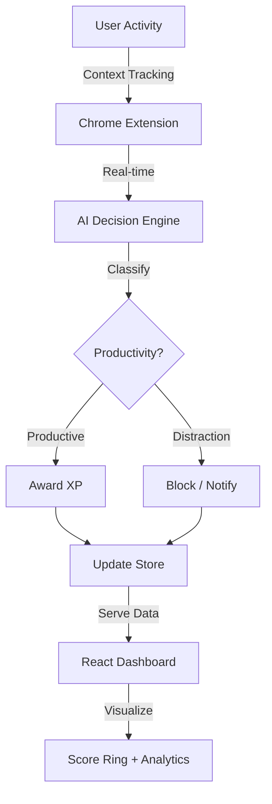

# 🧠 Saraswati: Context-Aware Productivity SaaS

Saraswati is a premium, startup-grade productivity ecosystem designed to transform how you work. It combines deep browser integration, AI-powered site classification, and a sophisticated gamification engine to drive high-performance behavior through a stunning glassmorphic dashboard.

---

## ✨ Premium Features

### 💎 Elite Design System
- **Glassmorphism UI:** A layered, translucent interface with multi-level blurs and holographic accents.
- **Fluent Animations:** Powered by `Framer Motion` for organic, high-end interactions and page transitions.
- **Dynamic Score Ring:** Real-time productivity visualization with animated progress and color-shifting gradients.

### 🎮 Gamification Engine (RPG Mode)
- **XP & Leveling:** Earn Experience Points (XP) for every minute spent on productive tasks. Level up as you master your focus.
- **Daily Streaks:** Maintain your momentum. Streaks award massive XP bonuses to encourage consistency.
- **Achievements:** Unlock prestigious badges (Focus Master, Deep Diver, Void Walker) as you hit productivity milestones.

### 🤖 AI Intelligence
- **Contextual Classification:** Real-time domain and path analysis to categorize your digital footprint.
- **AI Insights Engine:** Synthesizes your behavioral patterns into human-readable daily reports and actionable tips.
- **Smart Suggestions:** Dynamic advice tailored to your current productivity score and distraction ratio.

---

## 🏗️ Architecture



---

## 🚀 Getting Started

### Prerequisites
- **Node.js** v18+
- **Google Chrome**

### 1. Launch the Intelligence Layer (Backend)
```bash
cd backend
npm install
npm start
```
*Runs at http://localhost:5001*

### 2. Enter the Dashboard (Frontend)
```bash
cd dashboard
npm install
npm run dev
```
*Runs at http://localhost:5173 (or http://localhost:5174 if busy)*

### 3. Deploy the Field Agent (Chrome Extension)
1. Go to `chrome://extensions/`
2. Toggle **Developer Mode** on.
3. Click **Load unpacked** and select the `/extension` folder.
4. Pin **Saraswati** to your toolbar.

---

## 📊 Technical Stack

| Tier | Technologies |
| :--- | :--- |
| **Frontend** | React 19, Vite 8, Framer Motion, Recharts, Lucide Icons |
| **Styling** | Vanilla CSS (Premium Tokens), Tailwind CSS v4 |
| **Backend** | Node.js, Express.js |
| **Storage** | In-Memory Engine (Persistence Ready) |
| **Extension** | Manifest V3, Content Scripts, Service Workers |

---

## 📡 API Reference

| Endpoint | Method | Result |
| :--- | :--- | :--- |
| `/api/stats` | `GET` | Full Productivity + Gamification state |
| `/api/log` | `POST` | Record interaction + Award XP |
| `/api/summary` | `GET` | AI-generated behavioral report |
| `/api/focus` | `POST` | Toggle deep-work state |

---

## 🛡️ License

MIT License. Built with ❤️ for the Code Crafters 3.0 Hackathon.
